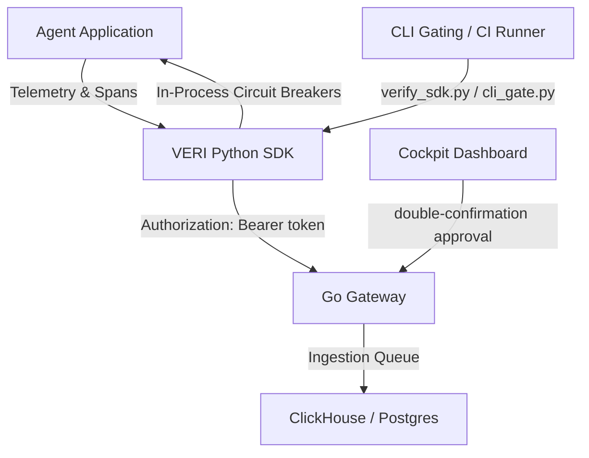

# 🌌 VERI.fy — BehaviorOS for Autonomous Agent Systems

> **The enterprise system of record and CI/CD quality gate for agentic workflows. Reconstruct, prove, contract, and version autonomous agent behavior.**

[](LICENSE)
[]()
[]()

VERI is the first developer platform built specifically for the **behavior of autonomous systems**. While traditional observability platforms (LangSmith, Braintrust, OpenTelemetry) record *what* happened for debugging, VERI treats autonomous execution as a versionable, testable, and contract-governed graph. It enables developers to answer **why** decisions occurred, **intercept and block** high-risk actions before they run, and **prevent regressions** in production agent networks.

---

## 💡 The Paradigm Shift: Behavior-Driven Infrastructure

Unlike static applications, agents fail stochastically due to model upgrades, prompt drifts, and shifting context vectors. VERI shifts the focus from raw text logs to structured behavior:

```
                  Traditional Observability vs. BehaviorOS
                  
      [ Raw Text Logs ]  ──►  Only tracks inputs/outputs (What)
      [ Prompt Version ] ──►  Fails to predict environment drift
      
      [ VERI BehaviorGraph ] ──► Tracks causal lineage, trust flow, 
                                and state evolution tree (Why)
```

---

## 🛠️ The 8 Pillars of BehaviorOS

### 1. 🌳 Unified Behavior Graph
Every agent execution is compiled into a typed graph mapping inputs, cognitive steps (planning, reflection, retries), actions, decisions, and side effects. All evaluation, diffing, and replay operations run as algorithms over this single source of truth.

### 2. 🛡️ Behavioral Contracts
Wrap high-risk agent functions with declarative safety policies using standard decorators. If a planner attempts to execute a tool outside of contract boundaries (e.g. price caps, forbidden parameters, lack of human sign-off), the contract engine intercepts and blocks the call.
```python
from veri.contracts import behavior_contract

@behavior_contract(max_price=1000.0, allowed_country="Japan", human_required=True)
def book_flight(price: float, country: str):
    # Enforced at runtime & during regression testing
    return f"Flight booked to {country} for ${price}"
```

### 3. 🔐 Cryptographic Runtime Fingerprinting
Catch silent Environment Drift. VERI captures active prompt templates, model versions, tool schemas, and environment packages, compiling them into a deterministic SHA-256 hash. If base models or external APIs change behind your back, the fingerprint breaks.

### 4. 🔄 True Causal Replay (Ablation Testing)
To find out why an agent failed, VERI isolates nodes and substitutes golden inputs from past working runs. If downstream behavior recovers, VERI proves mathematically that this node was the causal culprit.
*   ⚡ **Measured Replay**: Empirical verification of causal node failures.
*   🔮 **Estimated Heuristics**: Structural BFS graph distance estimation for non-replayable systems.

### 5. 🕒 Cognitive State Time Machine
Track state evolution. Instead of flat memory logs, the SDK captures incremental `StateDelta` mutations (planner updates, memory modifications, confidence changes) to let you step forward and backward through the agent’s internal reasoning timeline.

### 6. 📉 Causal Trust Propagation
Uncertainty decays downstream. Every retriever, planner, and tool node receives a local trust factor. VERI propagates this trust score using directed graph calculations:
$$T_i = (1 - U_i) \times C_i \times \prod_{j \in \text{parents}(i)} (T_j \cdot W_{ji})$$
If the trust flow collapses, VERI blocks execution immediately to prevent hallucinations.

### 7. 🕸️ Multi-Agent Causality
Trace root causes across agent boundaries. When multiple distributed agents interact with databases, web APIs, and human review gates, VERI reconstructs the unified distributed DAG to backtrack the root cause of failures.

### 8. 📦 Behavioral Supply Chain (BOM)
Generate a comprehensive **Behavior Bill of Materials (BOM)**. Trace any final output back to the specific prompts, models, document chunks, tool actions, and human reviews that contributed to it for strict audit and compliance needs.

---

## 🚀 System Architecture



---

## 📂 Project Directory Structure

```text
├── packages/
│   └── evolution-sdk-python/   # Public python client
│       ├── veri/
│       │   ├── contracts.py    # Decorator-based contracts & check engine
│       │   ├── fingerprint.py  # Runtime snapshot compilation & hashing
│       │   ├── lineage.py      # Behavior BOM & lineage tree reconstruction
│       │   ├── context.py      # Context managers, span stack, & replay graph builder
│       │   ├── escalation.py   # Policy control, resolution polling & signatures
│       │   └── cli_gate.py     # CI/CD regression test gating gate check
│       └── tests/              # Verification suites
└── services/
    ├── gateway/                # Go API gateway with Auth and Topological Replay Engine
    └── analyzer/               # Go background telemetry aggregation engine
```

---

## ⚡ Quickstart & Verification Suite

### 1. Boot up the Infrastructure Stack
Spin up Postgres, ClickHouse, NATS, Redis, and MinIO:
```bash
docker compose up -d
```

### 2. Launch Gateway and Analyzer Services
Run the Go backend services with production security checks:
```bash
.\run_end_to_end.bat
```

### 3. Run the Verification Tests
Validate core capabilities locally:
*   **Policy Engine & HMAC Signatures**: `python verify_escalation.py`
*   **Ablation Replay & Causal Core**: `python verify_sdk.py`
*   **Fuzzy Matching & Polarity Assertions**: `python verify_matcher.py`
*   **Universal Runtime IR Generation**: `python verify_ir.py`